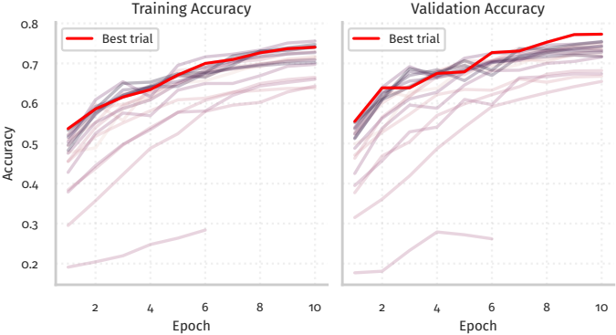

# Neuronale Netze in der Bildverarbeitung

Dieses Projekt entschand im Rahmen der Vorlesung "Neuronale Netze" bei Prof. Jan Bauer an der Hochschule Karslsruhe. Der Inhalt ist an die Stanford CS class [cs231n](https://cs231n.github.io/) von [Justin Johnson](https://web.eecs.umich.edu/~justincj/) angelehnt.

Ziel ist, mit verschiedenen Methoden den [CIFAR10](https://www.cs.toronto.edu/~kriz/cifar.html) Datensatz zu klassifizieren. Darüber hinaus wird der knn Algorithmus, Multiclass Support Vector Machines, Transfer Learning, semantische Segmentierung und Style Transfer behandelt, [Kaggle](https://www.kaggle.com/competitions/dogs-vs-cats) betrachtet.

Einige Codebestandteile sind durch die cs231n bereits vorgeeben, doch die relevante Implementierung (solver, classifiers, layers, backpropagation, …) musste selbst erstellt werden. 

## Beispiel

Im [notebooks/09_PyTorch.ipynb](notebooks/09_PyTorch.ipynb) wurde mithilfe von Pytorch der CIFAR10 Datensatz klassifiziert. Dazu wurde ein eigenen Modell erstellt und Baseian Search zur Hyperparameteroptimierung verwendet. Für Details zu Bayesian Search siehe den talk zu [Optimierungsverfahren](https://github.com/JaxRaffnix/Optimierungsverfahren/blob/main/build/talk.pdf).

<object data="talk/images/predictions_grid.pdf" type="application/pdf" width="1400px" height="700px">
    <embed src="talk/images/predictions_grid.pdf">
        
This browser does not support PDFs. Please download the PDF to view it: <a href="talk/images/predictions_grid.pdf">Download PDF</a>.

    </embed>
</object>

Eine Präsentation zu diesem Thema findet sich unter [talk/Präsentation Pytorch.pdf](talk/Präsentation%20Pytorch.pdf)

## Notebooks

- [notebooks/01_python_tutorial.ipynb](notebooks/01_python_tutorial.ipynb)
- [notebooks/02_SimpleClassification.ipynb](notebooks/02_SimpleClassification.ipynb)
- [notebooks/03_knn.ipynb](notebooks/03_knn.ipynb)
- [notebooks/04_msvm.ipynb](notebooks/04_msvm.ipynb)
- [notebooks/05_two_layer_net.ipynb](notebooks/05_two_layer_net.ipynb)
- [notebooks/06_image_features.ipynb](notebooks/06_image_features.ipynb)
- [notebooks/07_Modular_Backpropagation.ipynb](notebooks/07_Modular_Backpropagation.ipynb)
- [notebooks/08_ConvolutionalNetworks.ipynb](notebooks/08_ConvolutionalNetworks.ipynb)
- [notebooks/09_PyTorch.ipynb](notebooks/09_PyTorch.ipynb)
- [notebooks/10_TransferLearning.ipynb](notebooks/10_TransferLearning.ipynb)
- [notebooks/11_SemantischeSegmentierung.ipynb](notebooks/11_SemantischeSegmentierung.ipynb)
- [notebooks/12_StyleTransfer.ipynb](notebooks/12_StyleTransfer.ipynb)
